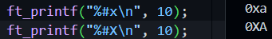
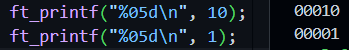
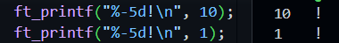
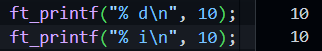
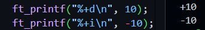
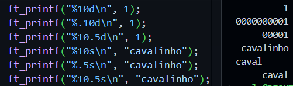

# Printf 42 Project

## What is it?
<p>The goal of this project is to recode printf() using only the <a href="https://github.com/rodrigo-br/libft_42" target="_blank"><b>libft</b></a> and the <a href="https://man7.org/linux/man-pages/man3/stdarg.3.html" target="_blank">variadic functions</a>.</p>

<br>

### A few rules

<p>As most of 42's Projects, this one also have a few rules (such as the prohibition of the use of 
<span style="color:#33DAFF">for</span>,
<span style="color:#33DAFF"> VLA</span>,
<span style="color:#33DAFF"> global variables</span>
and others).</p> 

<br>

## How to use it

```Bash
git clone git@github.com:rodrigo-br/printf_42.git

cd printf_42/

make

touch main.c

echo '#include "ft_printf.h"' > main.c

(write a main)

cc main.c libftprintf.a && ./a.out
```

Suggestion of main:

```C
#include "ft_printf.h"

int main(void)
{
	//simple printf printing a decimal, a string and a char
	ft_printf("%d %s%c\n", 10, "little horses walking outside", '!');

	//testing the return value of the printf
	int value;
	value = ft_printf("%d %s%c\n", 10, "little horses walking outside", '!');
	ft_printf("%d\n", value);

	//some flags
	ft_printf("%5d %#010X %p %%\n", 1, 99999, free);
}
```

## How printf works

Printf write the output under the control of a
       format string that specifies how subsequent arguments (or
       arguments accessed via the variable-length argument facilities of
       stdarg(3)) are converted for output.

### Format of the format string
The format string is a character string, beginning and ending in
       its initial shift state, if any.  The format string is composed
       of zero or more directives: ordinary characters (not %), which
       are copied unchanged to the output stream; and conversion
       specifications, each of which results in fetching zero or more
       subsequent arguments.  Each conversion specification is
       introduced by the character %, and ends with a conversion
       specifier.  In between there may be (in this order) zero or more
       flags, an optional minimum field width, an optional precision and
       an optional length modifier.

The overall syntax of a conversion specification is:

```
%[$][flags][width][.precision][length modifier]conversion
```

The ft_printf function isn't a copy of printf function, so, it's syntax is:

```
%[flags][width][.precision][length modifier]conversion
```
Note that only the [$] wasn't incluse.


### Flag characters

<ul>
	<li># <br>For x and X conversions, a nonzero result has the string
              "0x" (or "0X" for X conversions) prepended to it. Example :<br>
			  
	</li>
	<br><li>0<br>The value should be zero padded.  For d, i, o, u, x, X conversions, the converted value
    is padded on the left with zeros rather than blanks.  If
    the 0 and - flags both appear, the 0 flag is ignored.  If
    a precision is given with a numeric conversion (d, i, o,
    u, x, and X), the 0 flag is ignored.  For other
    conversions, the behavior is undefined. Example :<br>
			
	</li>
	<br><li>- (minus)<br>The converted value is to be left adjusted on the field
              boundary.  (The default is right justification.)  The
              converted value is padded on the right with blanks, rather
              than on the left with blanks or zeros.  A - overrides a 0
              if both are given. Example :<br>
			
	</li>
	<br><li>' ' (space)<br>A blank should be left before a positive number
              (or empty string) produced by a signed conversion. Example :<br>
			
	</li>
	<br><li>+<br>should always be placed before a number
              produced by a signed conversion.  By default, a sign is
              used only for negative numbers.  A + overrides a space if
              both are used. Example :<br>
			  
	</li>
</ul>

### Field width
An optional decimal digit string (with nonzero first digit)
       specifying a minimum field width.  If the converted value has
       fewer characters than the field width, it will be padded with
       spaces on the left (or right, if the left-adjustment flag has
       been given).

### Precision
An optional precision, in the form of a period ('.')  followed by
       an optional decimal digit string.  If
       the precision is given as just '.', the precision is taken to be
       zero.

Examples of width and precision:<br>


### Conversion specifiers

<ul>
	<li>d, i<br>  The int argument is converted to signed decimal notation.
              The precision, if any, gives the minimum number of digits
              that must appear; if the converted value requires fewer
              digits, it is padded on the left with zeros.  The default
              precision is 1.  When 0 is printed with an explicit
              precision 0, the output is empty</li>
	<br><li>u, x, X<br>The unsigned int argument is converted to unsigned decimal (u), or unsigned hexadecimal (x and
              X) notation.  The letters abcdef are used for x
              conversions; the letters ABCDEF are used for X
              conversions.  The precision, if any, gives the minimum
              number of digits that must appear; if the converted value
              requires fewer digits, it is padded on the left with
              zeros.  The default precision is 1.  When 0 is printed
              with an explicit precision 0, the output is empty.</li>
	<br><li>c<br>the int argument is converted
              to an unsigned char, and the resulting character is
              written.</li>
	<br><li>s<br>the const char * argument is
              expected to be a pointer to an array of character type
              (pointer to a string).  Characters from the array are
              written up to (but not including) a terminating null byte
              ('\0'); if a precision is specified, no more than the
              number specified are written.  If a precision is given, no
              null byte need be present; if the precision is not
              specified, or is greater than the size of the array, the
              array must contain a terminating null byte.</li>
	<br><li>p<br>The void * pointer argument is printed in hexadecimal as if by %#x</li>
	<br><li>%<br>A '%' is written.  No argument converted.  The complete conversion specification is '%%'.</li>

<br>

### Return Value

Return the number of
    characters printed (excluding the null byte used to end output to
       strings).
